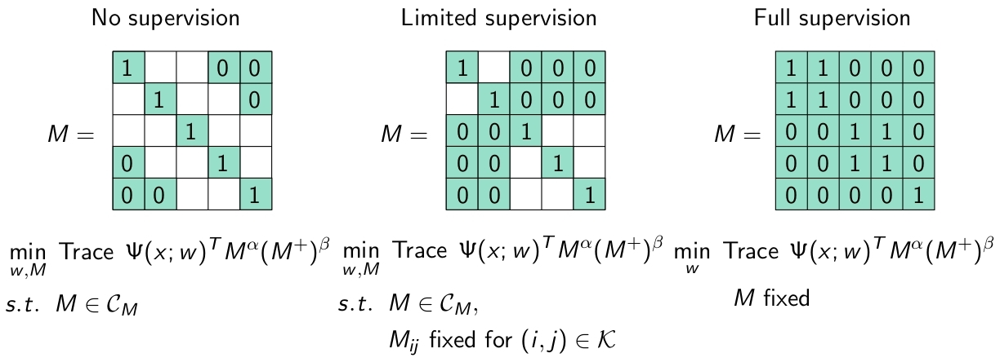

This repository contains companion code for the following paper:

C. Jones and Z. Harchaoui. End-to-End Learning for Retrospective Change-Point Estimation. In *Proceedings of the IEEE International Workshop on Machine Learning for Signal Processing* (to appear), 2020.

If you use this code please cite the paper using the bibtex reference below.

```
@inproceedings{JH2020,
  author    = {Jones, Corinne and Harchaoui, Zaid},
  title     = {End-to-End Learning for Retrospective Change-Point Estimation},
  booktitle = {30th {IEEE} International Workshop on Machine Learning for Signal Processing},
  year      = {2020},
}
```

Introduction
-----------------
In the paper *End-to-End Learning for Retrospective Change-Point Estimation* we propose a unified framework that allows one to jointly learn a feature representation from sequences with no labeled change points (with or without sequences with labeled change points) and estimate change points in sequences. The proposed approach is domain-agnostic and can be used with any amount of labeled, partially-labeled, and unlabeled sequences, gracefully adjusting to the amount of supervision. 

The proposed problems for the cases where we know none of the change points, some of the change points, or all of the change points are summarized in the figure below. 


Example equivalence matrix M = YY<sup>T</sup> and problem for varying levels of supervision when the number of change points is known to be two. In the limited supervision case one of the change points, at t = 3, is known. 

Here M = YY<sup>T</sup> is the equivalence matrix, where Y is the one-hot label matrix. The matrix Ψ(x; w)=-Φ(x; w)Φ(x; w)<sup>T</sup> is a function of the output of a network, Φ, where the network is parameterized by w. The set C<sub>M</sub> contains the constraints on the segment labels, while the set K contains the indices (i,j) for which the entries M<sub>i,j</sub> are known. 

Our XSCPE algorithm solves the above problem with additional penalty terms. The overall problem with these penalty terms can be rewritten as 


where 


Here 

  

and λ, γ ≥ 0 are hyperparameters. Assuming, e.g., that the norm of the gradient of the network with respect to w is bounded, this objective is bounded below. The algorithm alternates between estimating the change points t<sub>1</sub><sup>(i)</sup>,..., t<sub>m</sub><sup>(i)</sup> for all sequences i via dynamic programming and taking gradient steps to update w. 

Installation
-----------------
This code is compatible with Python 3.7 and was written with PyTorch version 1.4.0.

The primary Python package dependencies are:

* [Chapydette](https://github.com/cjones6/chapydette) version 0.1
* [Cython](https://cython.org/) version 0.29.14 
* [Faiss](https://github.com/facebookresearch/faiss) version 1.6.1 
* [Jupyter](https://jupyter.org/) version 4.6.1
* [Matplotlib](https://matplotlib.org/) version 3.1.1 
* [Numba](http://numba.pydata.org/) version 0.48.0
* [Numpy](https://numpy.org/) version 1.18.1 
* [PyTorch](https://pytorch.org/) version **1.4.0** and torchvision 0.5.0
* [Scikit-learn](https://scikit-learn.org/stable/) version 0.22.1 
* [Scipy](https://www.scipy.org/) version 1.3.2 


The remainder of the dependencies are standard and e.g., come pre-installed with Anaconda. The code can run on a CPU or GPU. The following terminal commands create a new Anaconda environment called *chpt* and install the GPU versions of the above packages, assuming you have Cuda 10.0:

```
conda create -y --name=chpt python=3.7
conda activate chpt
conda install cython jupyter matplotlib nb_conda numba numpy scikit-image scikit-learn scipy
conda install pytorch=1.4 torchvision cudatoolkit=10.0 -c pytorch
conda install faiss-gpu cudatoolkit=10.0 -c pytorch
git clone https://github.com/cjones6/chapydette  
cd chapydette  
python setup.py install
```

If you are using a Mac, you may need to also install llvm, gcc, and libgcc for the package chapydette:
```
conda install llvm gcc libgcc
```

If you wish to run the code on a GPU with a different version of Cuda, see the [PyTorch](https://pytorch.org/) and [Faiss](https://github.com/facebookresearch/faiss/blob/master/INSTALL.md) documentations. If you only have a CPU you should change the relevant two lines above to
```
conda install pytorch=1.4 torchvision cpuonly -c pytorch
conda install faiss-cpu -c pytorch
```

The code is currently set to run on a GPU. To run it on a CPU change the line 
`device = torch.device('cuda:0')`
 in the file src/default_params.py to `device = torch.device('cpu')`.
 
This version of the code is not compatible with older versions of PyTorch. The code has only been tested on Linux operating systems.

Datasets
-----------------
The experiments were performed using synthetic data, sequences of [MNIST](http://yann.lecun.com/exdb/mnist/) digits, and the [bee waggle dance](http://www.sangminoh.org/Publications_files/Oh08ijcv.pdf) dataset. 

For the bee waggle dataset the code assumes that you already [downloaded](https://github.com/OctoberChang/klcpd_code/tree/master/data/beedance) it and that you did not change the names of the files. The filepaths should be, e.g., `chpt-learn/data/beedance/beedance-1.mat`.

Example code
-----------------
An example Jupyter notebook that describes how to set up and train a LeNet-5 CKN on sequences of MNIST digits may be found at example/mnist_lenet-5_ckn_example.ipynb.

The shell scripts to reproduce the main experiments are in the subfolders under "experiments". You may need to modify the path to the data folder via the argument `data_path`. 

Contact
-----------------
You can report issues and ask questions in the repository's issues page. If you choose to send an email instead, please direct it to Corinne Jones at cjones6@uw.edu and include [xscpe] in the subject line.

Authors
-----------------
[Corinne Jones](https://www.stat.washington.edu/people/cjones6/)  
[Zaid Harchaoui](http://faculty.washington.edu/zaid/)  

License
-----------------
This code has a GPLv3 license.

Acknowledgements
--------------------------
This work was supported by NSF DMS 1810975 and faculty research awards.